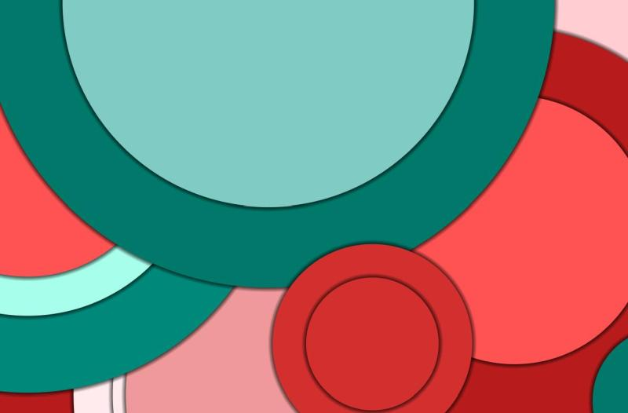

# MaterialDesignBgGenerator Adobe Illustrator Script
## Description
The script creates random backgrounds in the Material style.

## Install
Download file 'MaterialDesignBgGenerator.jsx' and put it in Adobe Illustrator Script directory
(e.g. c:\Program Files\Adobe\Adobe Illustrator 2023\Presets\en_US\Scripts).
Reload Illustrator and run script.
